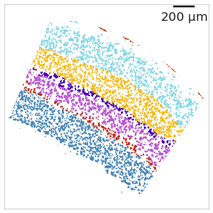

quick start / tldr page
=======================

This tl;dr guide is for you if you already know what happens in a SSAM
analysis or if you don’t care.

For everyone else we recommend using the full
`userguide <../userguide.md>`__.

Installation
------------

Setup a ``conda`` environment:

::

   conda create -n ssam python=3.6
   conda activate ssam
   conda install gxx_linux-64 numpy pip R=3.6 pyarrow=0.15.1

Do this in ``R``:

::

   install.packages("sctransform")
   install.packages("feather")

Install SSAM via ``pip``:

::

   pip install ssam

Data download
-------------

::

   curl "https://zenodo.org/record/3478502/files/supplemental_data_ssam_2019.zip?download=1" -o zenodo.zip
   unzip zenodo.zip

Data preparation
----------------

All following steps in ``python``:

::

   import numpy as np
   import pandas as pd
   import matplotlib.pyplot as plt
   import ssam

   df = pd.read_csv(
       "zenodo/multiplexed_smFISH/raw_data/smFISH_MCT_CZI_Panel_0_spot_table.csv",
       usecols=['x', 'y', 'z', 'target'])
       
   um_per_pixel = 0.1

   df.x = (df.x - df.x.min()) * um_per_pixel + 10
   df.y = (df.y - df.y.min()) * um_per_pixel + 10
   df.z = (df.z - df.z.min()) * um_per_pixel + 10
   width = df.x.max() - df.x.min() + 10
   height = df.y.max() - df.y.min() + 10

   grouped = df.groupby('target').agg(list)
   genes = list(grouped.index)
   coord_list = []
   for target, coords in grouped.iterrows():
       coord_list.append(np.array(list(zip(*coords))))

Create SSAM dataset and vector field
------------------------------------

::

   ds = ssam.SSAMDataset(genes, coord_list, width, height)
   analysis = ssam.SSAMAnalysis(
     ds,
     ncores=10, # used for kde step
     save_dir="kde/",
     verbose=True)

   analysis.run_kde(bandwidth=2.5, use_mmap=False)

   analysis.find_localmax(
       search_size=3,
       min_norm=0.2,
       min_expression=0.027
       )
       
   analysis.normalize_vectors_sctransform()

Creating the *de novo* cell map
-------------------------------

::

   analysis.cluster_vectors(
       min_cluster_size=0,
       pca_dims=22,
       resolution=0.15,
       metric='correlation')
       
   # post-filtering parameter for cell-type map
   filter_method = "local"
   filter_params = {
       "block_size": 151,
       "method": "mean",
       "mode": "constant",
       "offset": 0.2
   }

   analysis.map_celltypes()
   analysis.filter_celltypemaps(min_norm=filter_method, filter_params=filter_params, min_r=0.6, fill_blobs=True, min_blob_area=50, output_mask=output_mask)

.. figure:: ../images/de_novo.png
   :alt: Visualisation of cell type map.

   Visualisation of cell type map.

Creating the tissue domain map
------------------------------

::

   analysis.bin_celltypemaps(step=10, radius=100)
   analysis.find_domains(n_clusters=20, merge_remote=True, merge_thres=0.7, norm_thres=1500)

   plt.figure(figsize=[5, 5])
   ds.plot_domains(rotate=1, cmap=cmap)

   domains.

   Visualisation of final domain map exhibitin clearly separated
   domains.
