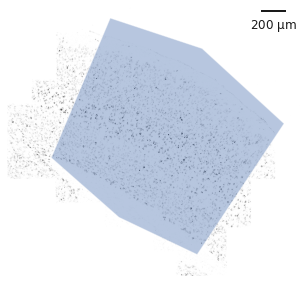
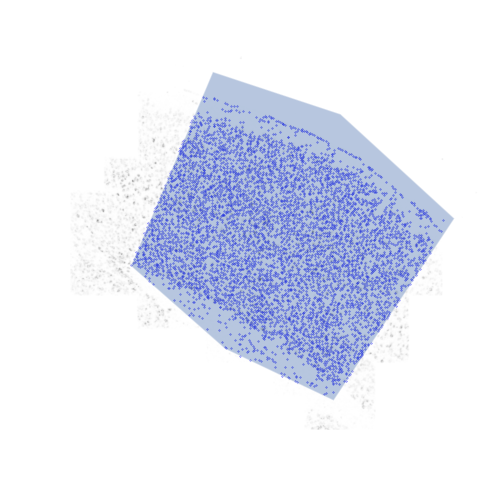

Creating the vector field
=========================

After the data has been loaded, SSAM converts the discrete mRNA
locations into mRNA desntiy (that can be thought of as continuous “gene
expression clouds” over the tissue) through application of `Kernel
Density Estimation <https://en.wikipedia.org/wiki/KDE>`__.

KDE
---

With our ``SSAMDataset`` object ``ds`` we can now initialize a
``SSAMAnalysis`` object ``analysis``.

::

   analysis = ssam.SSAMAnalysis(
     ds,
     ncores=10, # used for kde step
     save_dir="kde/",
     verbose=True)

And calculate a mRNA density estimate with the ``run_kde`` method.
Important considerations here are the `kernel
function <kernel_shape.md>`__ and the `kernel
bandwidth <kernel_bandwidth.md>`__. As default, we recommend using a
Gaussian kernel with a bandwidth of 2.5:

::

   analysis.run_kde(bandwidth=2.5, use_mmap=False)

Masking
-------

If you want to perform the analysis on `only a part of your sample you
can use a mask <inpu_mask>`__. This can restrict what parts of the image
are used for local maxima sampling (the ``input_mask``), or restrict the
cell-type map generation of SSAM to certain regions (the
``output_mask``). While this is not required for analysis (infact the
SSAM paper did not apply masks to the osmFISH or MERFISH dataset), here
we define a simply polygon as both the ``input_mask`` and
``output_mask`` for the VISp region.

::

   from matplotlib.path import Path
   # manual area annotation
   xy = np.array([[1535,  90],
                  [ 795,  335],
                  [ 135,  940],
                  [ 835, 1995],
                  [1465, 1695],
                  [2010, 1215]])

   # Extract coordinates from SSAMDataset
   x, y = np.meshgrid(np.arange(ds.vf.shape[0]), np.arange(ds.vf.shape[1]))
   x, y = x.flatten(), y.flatten()
   points = np.vstack((x,y)).T

   path = Path(xy)
   input_mask = path.contains_points(points)
   input_mask = input_mask.reshape((ds.vf.shape[1], ds.vf.shape[0], 1)).swapaxes(0, 1)
   output_mask = input_mask

We recommend a visual inspection of the mask to make sure it alignes
with the data as you expect it to:

::

   from matplotlib.patches import Polygon          
   from matplotlib.collections import PatchCollection

   patch = Polygon(xy, True)  
   p = PatchCollection([patch], alpha=0.4)

   plt.figure(figsize=[5, 5])
   ds.plot_l1norm(rotate=1, cmap="Greys")
   plt.gca().add_collection(p)
   plt.axis('off')
   plt.savefig('images/mask.png')

   plot of the mRNA density superimposed with the mask

Local maxima search and normalization
-------------------------------------

In order to reduce the computational burden, we recommend downsampling
the image. While random sampling can be performe, we strongly encourage
downsampling via local maxima selection, followed by `filtering based of
individual and total gene expression <max_filtering.md>`__.

The local maxima are used to (i) determine the variance stabilisation
parameters for the image, and (ii) be used to determine
`clusters <clustering.md>`__ in `de novo analysis <de_novo.md>`__. In
this section, we will use the local maxima for variance stabilisation.

Here we apply the ``find_localmax`` function to find the local maxima of
the mRNA density, using a per gene expression threshold of ``0.027`` and
a total gene expression threshold of ``0.2``:

::

   analysis.find_localmax(
       search_size=3,
       min_norm=0.2, # the total gene expression threshold
       min_expression=0.027, # the per gene expression threshold
       mask=input_mask
       )

Visualization
-------------

After the local maxima have been identified, they can be visualised. In
cases when many local maxima orginate from outside the tissue area a
`k-NN density threshold can be used to filter “stray” local
maxima <max_filtering.md#filtering-stray-local-maxima-using-k-nearest-neighbour-density>`__,
however in this example we use an input mask so it is not a problem.

::

   plt.figure(figsize=[5, 5])
   ds.plot_l1norm(cmap="Greys", rotate=1)
   ds.plot_localmax(c="Blue", rotate=1, s=0.1)

   patch = Polygon(xy, facecolor="black", edgecolor="red", linewidth=10, ls="-")
   p = PatchCollection([patch], alpha=0.4)
   plt.gca().add_collection(p)

   scalebar = ScaleBar(1, 'um') # 1 pixel = 1um
   plt.gca().add_artist(scalebar)
   plt.tight_layout()
   plt.axis('off')
   plt.show()

   plot found maxima superimposed with the mask

Normalization
-------------

Once the local maxima have been identified, we can use them for
calculating the variance stabilisation parameters using ``sctransform``.
If you receive an error here, make sure that you have installed the R
packages in the `installation <docs/installation.md>`__ step

This part of the analysis ends with the normalization of the mRNA
density and the local-maximum vectors.

::

   analysis.normalize_vectors_sctransform()

Now we are rady to continue with mapping the cell types in
`guided <guided.md>`__ or `de novo mode <de_novo.md>`__.
