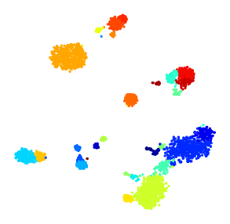

SSAM *de novo* analysis
=======================

While we believe that the `guided mode of SSAM <guided.md>`__ to be able
to generate good cell-type maps rapidly, the *de novo mode* provide much
more accurate results.

The steps of the *de novo* analysis are briefly discussed below, with
links to more detailed discussion:

-  `setting cell-type map correlation
   threshold <docs/celltype_map_thresh_d.md>`__
-  `visualisation of cell-type signatures: heatmap, tSNE,
   UMAP <docs/visualisation.md>`__

Clustering of expression vectors
--------------------------------

Once the local maxima have been selected and
`filtered <max_filtering.md>`__, we can perform `clustering
analysis <clustering.md>`__. SSAM supports `a number of clustering
methods <clustering.md>`__. Here we use the Louvain algorithm using 22
principle components, a resolution of 0.15.

::

   analysis.cluster_vectors(
       min_cluster_size=0,
       pca_dims=22,
       resolution=0.15,
       metric='correlation')

Cluster annotation and diagnostics
----------------------------------

SSAM provides `diagnostic plots <diagnostics.md>`__ which can be used to
evaluate the quality of clusters, and `facilitates the annotation of
clusters <cluster_annotation.md>`__.

Visualisng the clusters
-----------------------

SSAM supports `cluster visualisation via heatmaps, and 2D embedding
(t-SNE and UMAP) <visualisation.md>`__. Here we give an example of the
t-SNE plot:

::

   plt.figure(figsize=[5, 5])
   ds.plot_tsne(pca_dims=22, metric="correlation", s=5, run_tsne=True)
   plt.savefig('images/tsne.png')

   plot of t-SNE embedding of cell types

Cell type map
-------------

Once the clusters have been evaluated for quality, we can generate the
*de novo* cell-type map. This involves `classifying all the pixels in
the tissue image based on a correlation
threshold <celltype_map_thresh_d.md>`__. For the *de novo* application
``0.6`` was found to perform well:

::

   analysis.map_celltypes()

   filter_params = {
       "block_size": 151,
       "method": "mean",
       "mode": "constant",
       "offset": 0.2
       }
       
   analysis.filter_celltypemaps(min_norm="local", filter_params=filter_params, min_r=0.6, fill_blobs=True, min_blob_area=50, output_mask=output_mask)

::

   plt.figure(figsize=[5, 5])
   ds.plot_celltypes_map(rotate=1, set_alpha=False)
   plt.axis('off')
   plt.savefig('images/de_novo.png')

.. figure:: ../images/de_novo.png
   :alt: plot of the de novo generated celltype map

   plot of the de novo generated celltype map

We can now use our celltype map to infer a map of `tissue
domains <domain.md>`__.
