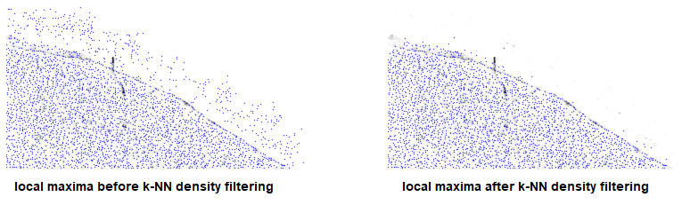

Filtering local maxima
======================

As demonstrated in the `SSAM
paper <https://www.biorxiv.org/content/10.1101/800748v2>`__, local L1
maxima selection is an effective way of downsampling the entire vector
field for faster computation, and they better represent known gene
expression profiles compared to random downsampling.

However, local maxima in the vector field can arrise from undesirable
locations, e.g. singleton mRNAs. In order to filter less informative
local maxima.

We recommend applying threshold for individual genes, and for the total
gene expression.

Per gene expression threshold
-----------------------------

The per gene threshold should be at least the height of a single
Gaussian curve over an mRNA. This can easily be empirically determined
by visual analysis. In this multiplexed smFISH exmaple, the per gene
expression threshold, ``exp_thres`` is set to 0.027

::

   exp_thres = 0.027
   viewport = 0.1
   gindices = np.arange(len(ds.genes))
   np.random.shuffle(gindices)
   plt.figure(figsize=[5, 7])
   for i, gidx in enumerate(gindices[:6], start=1):
       ax = plt.subplot(5, 2, i)
       n, bins, patches = ax.hist(ds.vf[..., gidx][np.logical_and(ds.vf[..., gidx] > 0, ds.vf[..., gidx] < viewport)], bins=100, log=True, histtype=u'step')
       ax.set_xlim([0, viewport])
       ax.set_ylim([n[0], n[-1]])
       ax.axvline(exp_thres, c='red', ls='--')
       ax.set_title(ds.genes[gidx])
       ax.set_xlabel("Expression")
       ax.set_ylabel("Count")
   plt.tight_layout()
   pass

|image0|

Total gene expression threshold
-------------------------------

The total gene threshold should be empirically determined by examing the
curve of total gene expression of local maxima. This isn’t always easy,
and we highly encourage investigating this thoroughly.

::

   norm_thres = 0.2
   gidx = 0
   plt.figure(figsize=[5, 2])
   #plt.hist(ds.vf[..., gidx][ds.vf[..., gidx] > 0], bins=100, log=True)
   n, _, _ = plt.hist(ds.vf_norm[np.logical_and(ds.vf_norm > 0, ds.vf_norm < 0.3)], bins=100, log=True, histtype='step')
   ax = plt.gca()
   ax.axvline(norm_thres, c='red', ls='--')
   ax.set_xlabel("L1-norm")
   ax.set_ylabel("Count")

   plt.xlim([0, 0.3])
   plt.ylim([np.min(n), np.max(n) + 100000])
   pass

|image1|

Filtering “stray” local maxima using k-nearest neighbour density
================================================================

If there is mRNA signal originating from outside the tissue area (due to
background noise), it would improve downstream analysis to remove such
vectors. We observed this in the osMFISH data. These “stray” local
maxima tend to be less dense than local maxima from the tissue area:

|image2|

Because of this, they can be effectively filtered using their k-neearest
neighbor density, in this example settting the ``threshold`` to 0.002.

::

   from sklearn.neighbors import KDTree
   X = np.array([ds.local_maxs[0], ds.local_maxs[1]]).T
   kdt = KDTree(X, leaf_size=30, metric='euclidean')
   rho = 100 / (np.pi * kdt.query(X, k=100)[0][:, 99] ** 2)

   threshold = 0.002

   plt.figure(figsize=[5, 2.5])
   plt.hist(rho, bins=100, histtype='step')
   plt.axvline(x=threshold, color='r', linestyle='--')

   ax = plt.gca()
   ax.set_xlabel("Local KNN density")
   ax.set_ylabel("Count")
   pass

|image3|

…. and a quick look at the before and after in the osmFISH dataset

|image4|

