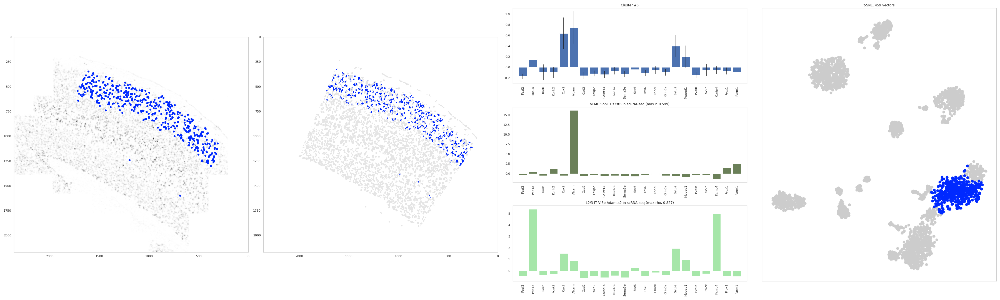
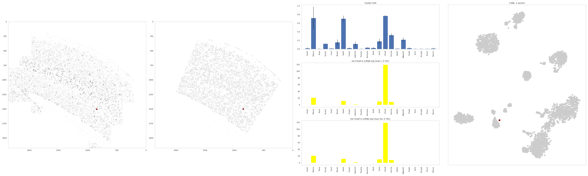
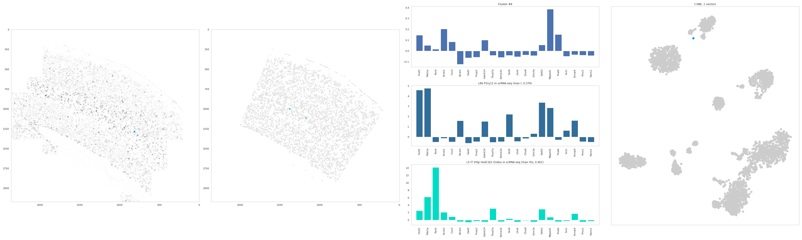

Diagnostic plots
================

After unsupervised clustering of gene expression vectors, some clusters
may need to be manually merged or discarded. SSAM supports merging of
clusters based on correlation of gene expression profile, however in
many cases manual inspection is needed to rule out any non-trivial
issues.

To guide this process, SSAM generates a cluster-wise ‘diagnostic plot’,
which consists of four panels: 1) location of the clustered vectors on
the tissue image, 2) the pixels classified to belong the cluster
signature (the cluster centroid), 3) the mean expression profile of the
clustered vectors, and 4) the t-SNE or UMAP embedding.

In the three datasets analyzed the clusters to be merged or removed
often showed a discordance between the location of sampled vectors used
to determine the cluster (panel 1) and the pixels classified to belong
to that cluster (panel 2). In case of overclustering, i.e. when a
cell-type signature is split over 2 clusters, the map typically does not
classify the full shape of the cells but instead only fragments (panel
2), and having almost the same marker gene expression of another cluster
(panel 3). Such clusters can be merged.

For dubious clusters that should be removed, we observed that vectors
usually originate from outside the tissue region or from image artifacts
(panel 1), or that the gene expression does not show any clear
expression of marker genes or similarity to expected gene expression
profiles (panel 3).

The remaining clusters are then annotated by comparing cluster marker
genes to known cell-type markers. Note that in many cases, the identity
of clusters can be easily assigned by comparing the centroids of the
clusters to the known cell-type signatures, e.g., from single cell RNA
sequencing.

To support rapid annotation of cell types to clusters, SSAM additionally
shows the highest correlating known cell-type signature should this data
be available in panel 3.

Example 1: a large cluster that can be easily annotated
-------------------------------------------------------

Local maxima (panel 1), correspond to the same area (panel 2), and
matches known gene expression patterns of *Vip Arhgap36 Hmcn1* cell
types from scRNAseq experiments with high correlation (panel 3)

|image0|

Example 2: a large cluster that cannot be easily annotated
----------------------------------------------------------

Local maxima (panel 1), correspond to the same area (panel 2). The gene
expression profile has a good correlation to *L2/3 IT VISp Adamts2* cell
types, but are lacking the very high expression of *Pde1a*. In this
particular case, one would need to check other clusters matching this
cell type and perhaps merge them, or perhaps this indicates low
efficiency of the *Pde1a* probe in the experiment.

|image1|

Example 3: a small cluster that is good
---------------------------------------

Despite only 2 local maxima (panel 1), the classified pixels correspond
to the same area (panel 2), and matches known gene expression patterns
(panel 3). This presents a very rare, SSt Chodl cell type.

|image2|

Example 4: a small cluster that is questionable
-----------------------------------------------

Sampled local maxima (panel 1) to no correspond to the classified pixels
(panel 2), and doesnt clearly match known gene expression patterns
(panel 3)

|image3|

.. |image0| image:: ../images/diagplot_centroid_2.png

