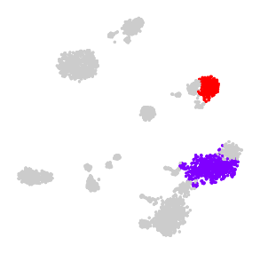

Cluster annotation
==================

In a typical single cell RNAseq experiment, the process of annotating
cell types manually can be laborious and as such, `a number of automated
methods have emerged <https://doi.org/10.1186/s13059-019-1795-z>`__.

In a typical *in situ* transcriptomics experiment, the annotation of
cell types is usually much easier as these assays are usually profile
established cell type markers. Cluster can be annotated easily based on
marker gene expression.

The `diagnostic plots <diagnostic.md>`__ can be used to compare existing
signatures against those identified *de novo*

::

   from scipy.stats import pearsonr, spearmanr

   for idx in range(len(ds.centroids)):
       plt.figure(figsize=[50, 15])
       ds.plot_diagnostic_plot(idx, known_signatures=[
           ("scRNA-seq", scrna_uniq_labels, scrna_centroids, scrna_colors),
       ], correlation_methods=[
           ("r", pearsonr),
           ("rho", spearmanr)
       ])
       plt.tight_layout()
       plt.savefig('diagplots_multiplexed_smFISH/diagplot_centroid_%d.png'%idx)
       plt.close()

This will generate a diagnostic plot for each cluster, which can be used
to assign cluster labels. E.g. the following cluster matches known gene
expression patterns of Vip Arhgap36 Hmcn1 cell types from scRNAseq
experiments with high correlation (panel 3):

|image0|

While this is a good example of cluster that can be easily annotated,
some clusters may prepresent noise and would need to be removed, and
when over clustering occurs then clusters may have to be merged. The
`diagnostic plots documentation <diagnostic.md>`__ assist the decision
making process.

Once each cluster is reviewed, a cell-type be assigned, or removed, or
merged. In the following code snippet, we show an elegent way to
annotate, remove, and merge clusters.

1) Determine that (i) clusters with a name will be annotated, (ii)
   clusters with a “N/A” will be removed, (iii) clusters with the same
   name will be merged

::

   denovo_labels = [
       "N/A",
       "VLMC",
       "Vip Arhgap36 Hmcn1 / Vip Igfbp4 Map21l1",
       "L2/3 IT Rrad",
       "N/A",
       "L2/3 IT Adamts2",
       "Sst Nts / Sst Rxfp1 Eya1",
       "Lamp5 Lsp1",
       "N/A",
       "Sst Crhr2 Efemp1 / Sst Esm1",
       
       "Pvalb Calb1 Sst / Pvalb Reln Tac1",
       "Astro Aqp4",
       "L6 IT Penk Fst",
       "L4 IT Superficial",
       "L5 IT Col27a1",
       "L2/3 IT Adamts2",
       "OPC",
       "Oligo",
       "L4 IT Rspo1",
       "L5 NP Trhr Met",
       
       "L5 IT Hsd11b1 Endou",
       "Pvalb Th Sst / Pvalb Reln Tac1",
       "L6 CT Ctxn3 Brinp3 / L6 CT Gpr139",
       "L5 PT Chrna6",
       "L5 IT Batf3",
       "L5 PT C1ql2 Cdh13",
       "L5 PT Krt80",
       "L6 IT Penk Col27a1",
       "L6 IT Penk Col27a1",
       "L6b Crh",
       
       "Sst Chodl",
   ]

2) make objects for storing the index of clusters to be annotated,
   removed and merged

::

   denovo_labels_final = []
   exclude_indices = []
   merge_indices = []

3) iterate over the ``denovo_labels`` object and populate the
   ``denovo_labels_final``, ``exclude_indices``, ``merge_indices``
   objects

::

   for idx, cl in enumerate(denovo_labels):
       if cl == 'N/A':
           exclude_indices.append(idx)
           continue
       if cl in denovo_labels_final:
           continue
       denovo_labels_final.append(cl)

   for cl in np.unique(denovo_labels):
       if cl == 'N/A':
           continue
       mask = [cl == e for e in denovo_labels]
       if np.sum(mask) > 1:
           merge_indices.append(np.where(mask)[0])

4) plot the removed clusters in t-SNE embedding

::

   cmap = plt.get_cmap('jet')
   jet_colors = cmap(np.array(list(range(len(ds.centroids)))) / (len(ds.centroids) - 1))
   tsne_colors = np.zeros_like(jet_colors)
   tsne_colors[..., :] = [0.8, 0.8, 0.8, 1]
   tsne_colors[exclude_indices] = [0, 0, 0, 1] #jet_colors[exclude_indices]
   import matplotlib.patheffects as PathEffects
   plt.figure(figsize=[5, 5])
   ds.plot_tsne(pca_dims=33, metric="correlation", s=5, run_tsne=False, colors=tsne_colors)
   plt.axis('off')

|image1|

5) plot the merged clusters in t-SNE embedding

::

   cmap = plt.get_cmap('rainbow')
   jet_colors = cmap(np.array(list(range(len(merge_indices)))) / (len(merge_indices) - 1))
   plt.figure(figsize=[5, 5])
   tsne_colors = np.zeros([len(ds.centroids), 4])
   tsne_colors[..., :] = [0.8, 0.8, 0.8, 1]
   for idx, mi in enumerate(merge_indices):
       tsne_colors[mi] = jet_colors[idx]
       ds.plot_tsne(pca_dims=33, metric="correlation", s=5, run_tsne=False, colors=tsne_colors)
   plt.axis('off')

|image2|

6) update the ``analysis`` object with the clusters to remove and merge

::

   analysis.exclude_and_merge_clusters(exclude_indices, merge_indices, centroid_correction_threshold=0.6)

.. |image0| image:: ../images/diagplot_centroid_2.png

