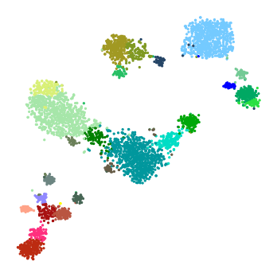

Visualisation of 2D gene expression embeddings (t-SNE and UMAP)
===============================================================

An important part of presenting the summary of the clustering analysis
is 2D visualisation via embedding.

`UMAP <https://arxiv.org/abs/1802.03426>`__ and
`t-SNE <http://jmlr.org/papers/volume9/vandermaaten08a/vandermaaten08a.pdf>`__,
are 2 common dimensionality reduction methods that can be useful for
displaying clustering results.

Running t-SNE
-------------

To run the t-SNE on the ``ds`` object:
``ds.run_tsne(pca_dims=-1,n_iter=5000, perplexity=70, early_exaggeration=10, metric="correlation", exclude_bad_clusters=True, random_state=0, tsne_kwargs={})``

.. where:

-  ``pca_dims``: Number of PCA dimensions used for the tSNE embedding.
-  ``n_iter``: Maximum number of iterations for the tSNE.
-  ``perplexity``: The perplexity value of the tSNE (please refer to the
   section `How should I set the perplexity in
   t-SNE? <https://lvdmaaten.github.io/tsne/>`__ ).
-  ``early_exaggeration``: Early exaggeration parameter for tSNE.
   Controls the tightness of the resulting tSNE plot.
-  ``metric``: Metric for calculation of distance between vectors in
   gene expression space.
-  ``exclude_bad_clusters``: If true, the vectors that are excluded by
   the clustering algorithm will not be considered for tSNE computation.
-  ``random_state``: Random seed or scikit-learn’s random state object
   to replicate the same result
-  ``tsne_kwargs``: Other keyward parameters for tSNE.

Running UMAP
------------

To run the t-SNE on the ``ds`` object:
``ds.run_umap(self, pca_dims=-1, metric="correlation", min_dist=0.8, exclude_bad_clusters=True, random_state=0, umap_kwargs={})``

.. where:

-  ``pca_dims``: Number of PCA dimensions used for the UMAP embedding.
-  ``metric``: Metric for calculation of distance between vectors in
   gene expression space.
-  ``min_dist``: ‘min_dist’ parameter for UMAP.
-  ``exclude_bad_clusters``: If true, the vectors that are excluded by
   the clustering algorithm will not be considered for UMAP computation.
-  ``random_state``: Random seed or scikit-learn’s random state object
   to replicate the same result
-  ``umap_kwargs``: Other keyward parameters for UMAP.

Plotting embeddings
-------------------

Plotting of the t-SNE and UMAP beddings can be performed by:

::

   ds.plot_embedding(method='umap')
   ds.plot_embedding(method='tSNE')

|image0|

