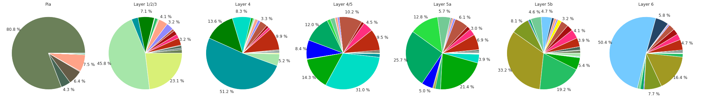
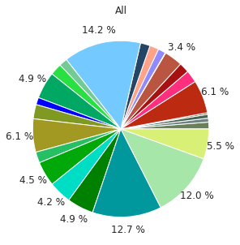

Cell-type composition analysis in tissue domains
================================================

After identifying `tissue domains <domain.md>`__ that exhibit specific
cell-type composition properties, it may be desirable to report the
cell-type composition properties of the identified domains.

In the `SSAM
manuscript <https://www.biorxiv.org/content/10.1101/800748v2>`__ we used
this functionality to identify that astrocytes cell type representation
of neocortex layer were previously under-reported, and identified the
cell-type composition of novel layering patterns in the primary visual
cortex (VISp).

Performing the cell-type composition analysis
---------------------------------------------

The analysis is initiated on the ``analysis`` object:

::

   analysis.calc_cell_type_compositions()

Plotting the composition of each domain
---------------------------------------

Once this has completed, you can plot the cell-type composition of the
different layers using the plot function. In the following exmaple, we
plot the 7 identified layers (``domain_index = 0-6``) in the order that
they would appear in the neocortex:

::

   # note - this could be wrapped up into a function
   for domain_idx in [1, 0, 2, 3, 4, 5, 6]:
       plt.figure(figsize=[5, 5])
       ds.plot_celltype_composition(domain_idx,
                                    cell_type_colors=denovo_celltype_colors,
                                    cell_type_orders=heatmap_clusters_index[::-1],
                                    label_cutoff=0.03)
       plt.title(domain_labels[domain_idx])

|image0|

Plotting the composition of the entire tissue
---------------------------------------------

It would be worthwhile to compare the cell-type composition within each
domain, and compare this to what is observed over the entire tissue. The
cell-type compostion over the entire tissue is stored as the last
domain, in this case the 8th element (``domain_index = 7``):

::

   # note - this can be wrapped up into a function
   plt.figure(figsize=[5, 5])
   ds.plot_celltype_composition(domain_index=7,
                                cell_type_colors=denovo_celltype_colors,
                                cell_type_orders=heatmap_clusters_index[::-1],
                                label_cutoff=0.03)
   plt.title('All')

|image1|

