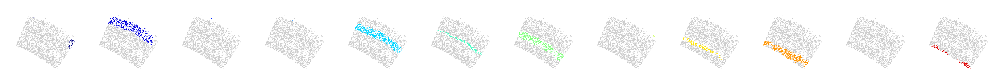
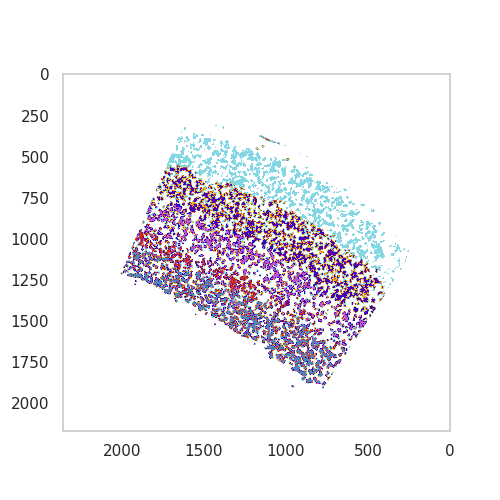

Identifying tissue domains
==========================

Cells are organised into tissues and organs. Spatial gene expression not
only allows the identification of cell types *in situ*, but also allows
investigation of how these cells are organised.

SSAM facilitates the identification of “tissue domains”, which are
regions in the tissue exhibiting similar local cell type composition.
This is based on circular window sampling with a defined ``radius`` and
``step``, which is then followed by `agglomerative
clustering <https://scikit-learn.org/stable/auto_examples/cluster/plot_cluster_comparison.html>`__.

Perform circular window sampling
--------------------------------

The first step is to sample cell-type composition in circular sweeping
windows. For this, the size of circular window (``radius``) and the step
between each sampling (``step``) has to be defined. The units here are
in um, which is also equivalent to pixels in this example. The following
performs this sampling using a circular window of 100um, with 10um
steps:

::

   analysis.bin_celltypemaps(step=10, radius=100)

Clustering domain signatures
----------------------------

After performing the sampling, we continue with identifying domain
signatures through clustering. This is based on agglomerative clustering
to identify the initial clusters (``n_clusters``) of windows which
include a minimum number of classified pixels (``norm_thres``), followed
cluster merging when the correlation between clusters exceeds a
threshold (``merge_thres``). The merging of clusters can be restricted
to adjacent clusters (``merge_remote=FALSE``), or not restricted to
spatial proximity (``merge_remote=True``)

::

   analysis.find_domains(n_clusters=20, merge_remote=True, merge_thres=0.7, norm_thres=1500)

Visualizing identified domains
------------------------------

Once the domains have been indentified, they have to be visualised for
evaluation.

::

   from matplotlib.colors import ListedColormap
   cmap_jet = plt.get_cmap('jet')
   num_domains = np.max(ds.inferred_domains_cells) + 1
   for domain_idx in range(num_domains):
       plt.figure(figsize=[5, 5])
       cmap = ListedColormap([cmap_jet(lbl_idx / num_domains) if domain_idx == lbl_idx else "#cccccc" for lbl_idx in range(num_domains)])
       ds.plot_domains(rotate=1, cmap=cmap)

|image0|

Post-processing the identified domains
--------------------------------------

In certain cases, one may wish to **exclude certain domains**
(``excluded_domain_indices``) as they may originate from tissue
artifacts or contain no information. In the case of the above, domain
number 8 (which is the 7th index, as it the numbering starts from 0!)
contains no information, so it can be removed.

Due to possible imaging artifacts such as tiling, some domains might be
split. While it is still possible to tune the ``merge_thres`` in the
clustering step, one can simply perform this as manual post processing.
In the case above, there do not appear to be any domains that require
merging.

Once the domains to be excluded or merged have been determined, they can
be excluded and removed(!):

::

   excluded_domain_indices = [7]
   merged_domain_indices = []
   analysis.exclude_and_merge_domains(excluded_domain_indices, merged_domain_indices)

The final plot
--------------

The individual domains represent the established neocortex layering
patterns found in the mouse brain. We can continue with assigning domain
colours, names, and plotting all of the domains together.

::

   # Define domain colors

   domain_colors = {
       'Pia': '#D44218',
       'Layer 1/2/3': '#85D7E4',
       'Layer 4': '#F6B813',
       'Layer 4/5': '#4900B9',
       'Layer 5a': '#BA55D3',
       'Layer 5b': '#C6271B',
       'Layer 6': '#4987B9',
   }

   # Define domain labels

   domain_labels = [
       'Layer 1/2/3',
       'Pia',
       'Layer 4',
       'Layer 4/5',
       'Layer 5a',
       'Layer 5b',
       'Layer 6',
   ]

   # Make the plot

   from matplotlib.colors import ListedColormap
   plt.figure(figsize=[5, 5])
   cmap = ListedColormap([domain_colors[lbl] for lbl in domain_labels])
   ds.plot_domains(rotate=1, cmap=cmap)

|image1|

