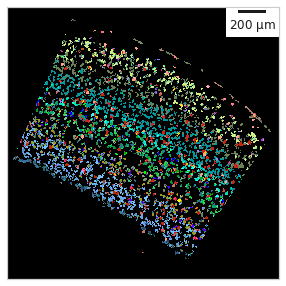

SSAM *guided* analysis
======================

The main visual output of SSAM is the creation of the cell-type map,
which is created by classifying pixels in the tissue image based of
either predefined or calculated genes expression signatures. When the
gene expression signatures are already known, one can use SSAM in
*guided* mode. When previously known cell type signatures are known, we
highly recommend running *guided* mode analysis as a quality check.

Single cell RNA sequencing data
-------------------------------

We will use scRNA-seq data from `Tasic et al.
2018 <https://doi.org/10.1038/s41586-018-0654-5>`__ for the guided
analysis. In the paper they identified “shared and distinct
transcriptomic cell types across neocortical areas” in the mouse brain,
also including the mouse VISp (which is our exmaple).

First we need to load the data:

::

   scrna_cl = pd.read_feather("zenodo/multiplexed_smFISH/raw_data/scrna_data_tasic_2018/cl.feather")
   scrna_cl_df = pd.read_feather("zenodo/multiplexed_smFISH/raw_data/scrna_data_tasic_2018/cl_df.feather")
   scrna_genes = pd.read_feather("zenodo/multiplexed_smFISH/raw_data/scrna_data_tasic_2018/genes.feather")
   scrna_counts = pd.read_feather("zenodo/multiplexed_smFISH/raw_data/scrna_data_tasic_2018/counts.feather")

   scrna_clusters = scrna_cl['cluster_id']

   scrna_cl_dic = dict(zip(scrna_cl['cell_id'], scrna_cl['cluster_id']))
   scrna_cl_metadata_dic = dict(zip(
       scrna_cl_df['cluster_id'],
       zip(scrna_cl_df['cluster_label'],
           scrna_cl_df['cluster_color'], )
   ))

   qc_gene_indices = np.sum(scrna_counts > 0, axis=1) > 5
   scrna_genes_qc = np.array(scrna_genes)[qc_gene_indices]

   scrna_counts_qc = np.array(scrna_counts).T[:, qc_gene_indices]

Normalisation
-------------

Once the data is loaded, we will normalise it using ``run_sctransform``:

::

   scrna_data_normalized = np.array(ssam.run_sctransform(scrna_counts_qc)[0])

Cell-type gene expression signatures
------------------------------------

Once the data is normalised, we can calculate the average gene
expression per cell type (the ``centroids``), which can then be used for
classifying pixels in the image

::

   selected_genes_idx = [list(scrna_genes_qc).index(g) for g in ds.genes]
   scrna_uniq_clusters = np.unique(scrna_clusters)
   scrna_centroids = []
   for cl in scrna_uniq_clusters:
       scrna_centroids.append(np.mean(scrna_data_normalized[:, selected_genes_idx][scrna_clusters == cl], axis=0))

Generate a *guided* cell-type map
---------------------------------

We can now continue to classify pixels in the tissue image using the
cell-type gene expression signatures from the sc-RNAseq data.

We map the local maxima vectors to the most similar clusters in the
scRNA-seq data using, using a `correlation threshold of classifying
pixels of ``0.6`` <celltype_map_thresh_g.md>`__

::

   analysis.map_celltypes(scrna_centroids) # map the scRNAseq cell type signatures to the tissue image
   analysis.filter_celltypemaps(min_norm=filter_method, filter_params=filter_params, min_r=0.3, output_mask=output_mask) # post-filter cell-type map to remove spurious pixels

   plt.figure(figsize=[5, 5]) # initiate the plotting area
   ds.plot_celltypes_map(rotate=1, colors=scrna_colors, set_alpha=False) # SSAM plotting function

|image0|

Despite the guided mode producing passable results, we highly recommend
using the `de novo mode for more accurate analysis <de_novo.md>`__.

