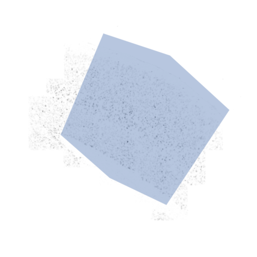

Input masks
===========

For some tissue images you may want to restrict analysis to certain
parts of the image. For example, the image may have degradation towards
the edges, you may wish to exclude non tissue areas, or even perhaps
restricting SSAM analysis to previously segmented areas.

SSAM accepts input masks that are defined as polygons.

Example for the VISp smFISH dataset:

::

   from matplotlib.patches import Polygon
   from matplotlib.collections import PatchCollection

   plt.figure(figsize=[5, 5])
   ds.plot_l1norm(cmap="Greys", rotate=1)
   ds.plot_localmax(c="Blue", rotate=1, s=0.1)

   patch = Polygon(xy, facecolor="black", edgecolor="red", linewidth=10, ls="-")
   p = PatchCollection([patch], alpha=0.4)
   plt.gca().add_collection(p~)
   plt.show()

|image0|

After the desired region selected, a ``mask`` can be created. In this
case we define an ``input_mask`` and ``output_mask`` which restricts all
data process anf reported output to the selected region.

::

   from matplotlib.path import Path

   x, y = np.meshgrid(np.arange(ds.vf.shape[0]), np.arange(ds.vf.shape[1]))
   x, y = x.flatten(), y.flatten()
   points = np.vstack((x,y)).T

   path = Path(xy)
   input_mask = path.contains_points(points)
   output_mask = input_mask = input_mask.reshape((ds.vf.shape[1], ds.vf.shape[0], 1)).swapaxes(0, 1)

