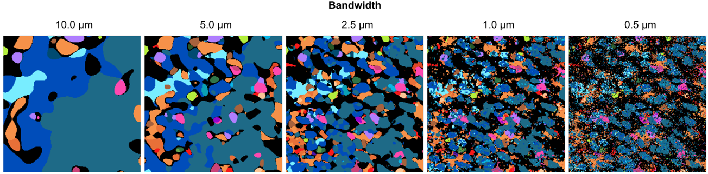

Kernel bandwidth
================

The bandwidth of the kernel controls the amount of smoothing applied.
With a low bandwidth, the smooth is spread less. With a high badnwidth,
the smoothing is spread more.

The bandwidth should be set according to 2 factors: - the maximum size
of the bandwidth should not smooth the signals outside of cells. by
default we choose a bandwidth of 2.5 um, as this has a FWTM or ~10um,
which is the average size of cells in the mouse SSp. This worked well
for all examples in the SSAM paper. - the minimum size of the bandwidth
should at least smooth signal to adjacent mRNA. From experience, this is
not an issue for most ISH based techniques, but sequencing based
techniques such as ISS can produce very sparse data and may require
higher bandwidths to smooth signal sufficiently.

Here is a close-up of the osmFISH mouse SSp dataset which investigates
the effect of adjusting the kernel bandwidth. You can see that with a
bandwidth of 1um the smoothing is sufficient, and with a bandwidth of
5um it is a little too much. The bandwidth of 2.5um appears to be a good
balance of smoothing adjacent signal, while not smooting into the
adjacent area or loosing sparse cell types.

|image0|

